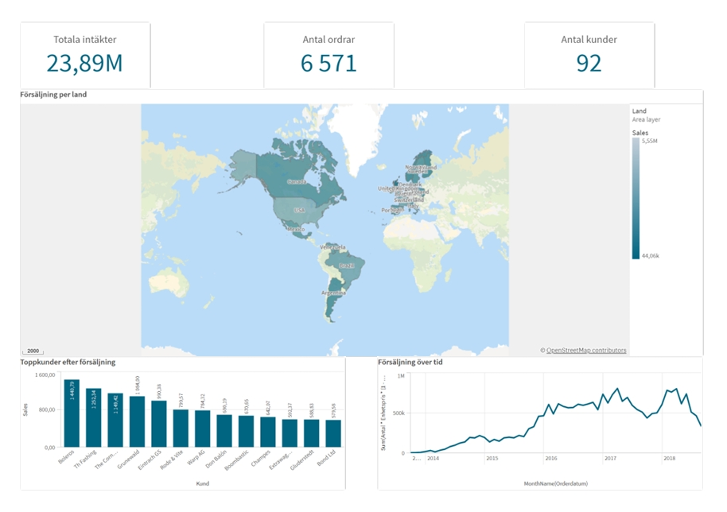
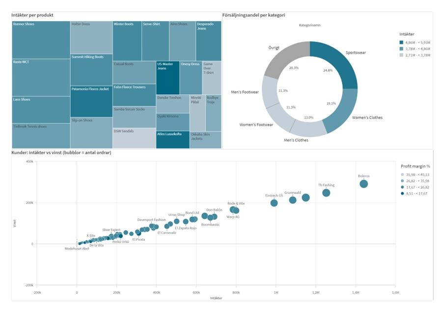
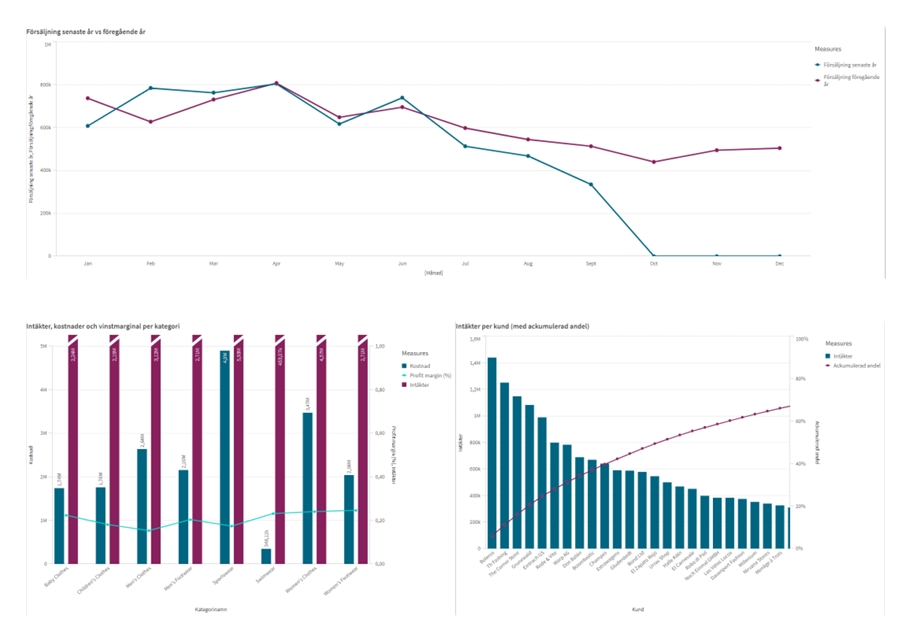

# Qlik-Sense-projektarbete

## 📌 Overview  
This repository contains my Qlik Sense project (Course Project Work), where I developed a complete **business intelligence dashboard** for analyzing sales, customers, products, and geographical distribution.  

The project demonstrates how **data-driven decision-making** can be supported by interactive dashboards:  
- Provide **KPI metrics** for total sales, number of orders, and customers  
- Analyze **sales distribution per country** using geo-maps  
- Identify **top customers** and visualize their revenue contribution (Pareto 80/20)  
- Compare **sales performance over time** and between years  
- Break down **revenues, costs, and profit margins** per product category  
- Drill down to **transaction-level details** with pivot and detail sheets  

The solution combines **visual storytelling** with actionable insights for controllers, sales managers, and analysts.  

---

## 🛠 Demonstrated Practical Skills  

- **Data modeling** – Loading and joining QVD files (Orders, Customers, Products, Calendar, Employees)  
- **Set Analysis** – Building advanced Qlik expressions (YTD vs LYTD, Pareto, AOV, Profit Margin)  
- **Variable management** – Defining reusable variables for QVD paths and calculations  
- **Data visualization** – Using bar charts, line charts, scatterplots, pie/donut charts, treemaps, and pivot tables  
- **Dashboard design** – Creating user-friendly layouts with filters, KPIs, and drill-down options  
- **Trend analysis** – Year-over-year sales comparison and accumulated Pareto share  
- **Controller perspective** – Transaction-level detail view with costs, revenues, and margins  

---

## 📊 Key Dashboards  

- **Dashboard** – KPI overview (Sales, Orders, Customers) + sales by country and time  
- **Overview Sheet** – Top customers and sales trends  
- **Analysis** – Sales YoY comparison, Pareto by customer, margins by category  
- **Pivot** – Multi-dimensional pivot table for deeper analysis  
- **Detail View** – Transaction-level data for controller validation  
- **Information** – Documentation of metrics, fields, and definitions  

---

## 🚀 How to Use  

1. Download the `.qvf` file from this repository  
2. Open it in **Qlik Sense Desktop**  
3. Explore the dashboards interactively  
4. Optionally, export sheets to **PDF/PowerPoint** for reporting  

---

### Dashboard Overview

### Product & Category Analysis

### Yearly & Customer Analysis

 

---

## 📌 Reflections  

One of the main challenges was building correct expressions in **Qlik Set Analysis** to calculate key metrics like profit margin, accumulated Pareto share, and average order value. Another important aspect was designing the sheets in a way that is both **logical for users** and **visually appealing**.  

By creating different types of visualizations (line charts, bars, pie charts, scatterplots, treemaps, and pivot tables), the project demonstrates the **full breadth of Qlik Sense capabilities**.  

---
